# GAMES101 HW

## hw1

[output.png](hw1/image/output.png)

## hw2

> Finished anti-aliasing.

[output.png](hw2/image/output.png)

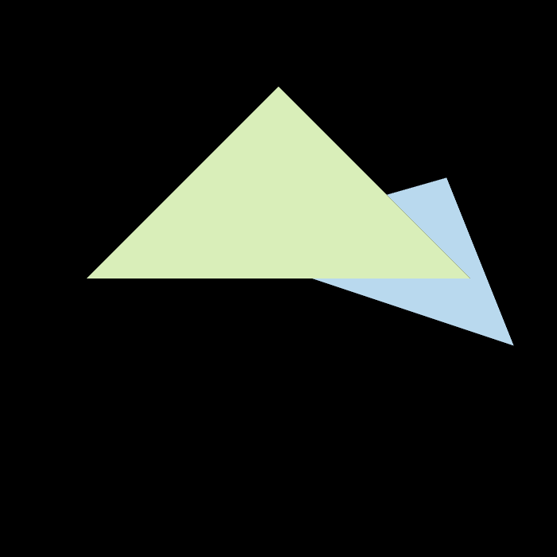

## hw3

[normal.png](hw3/image/normal.png)

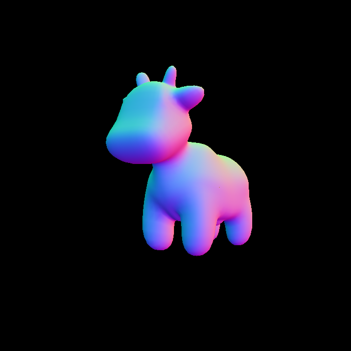

[phong.png](hw3/image/phong.png)

[texture.png](hw3/image/texture.png)

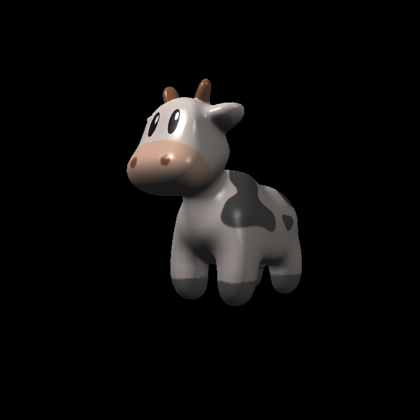

[bump.png](hw3/image/bump.png)

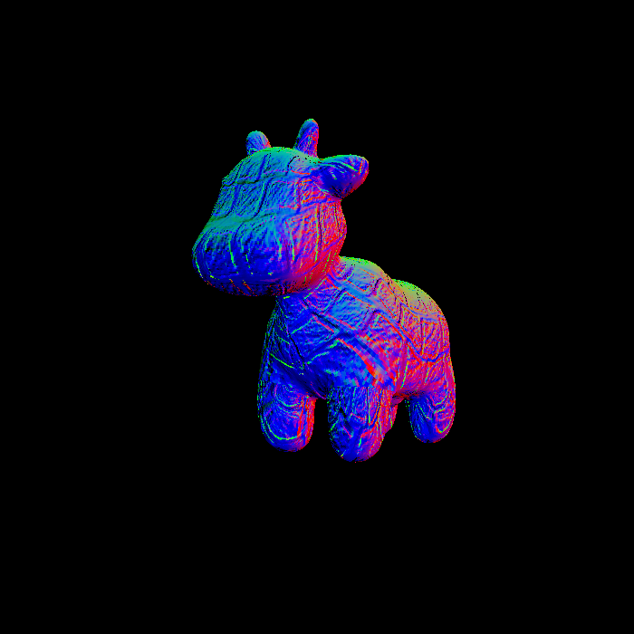

[displacement.png](hw3/image/displacement.png)

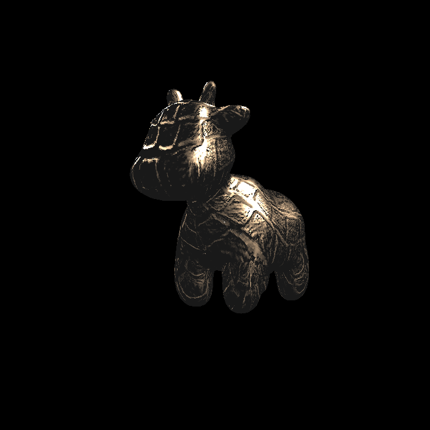

## hw4

[my_bezier_curve.png](hw4/image/my_bezier_curve.png)

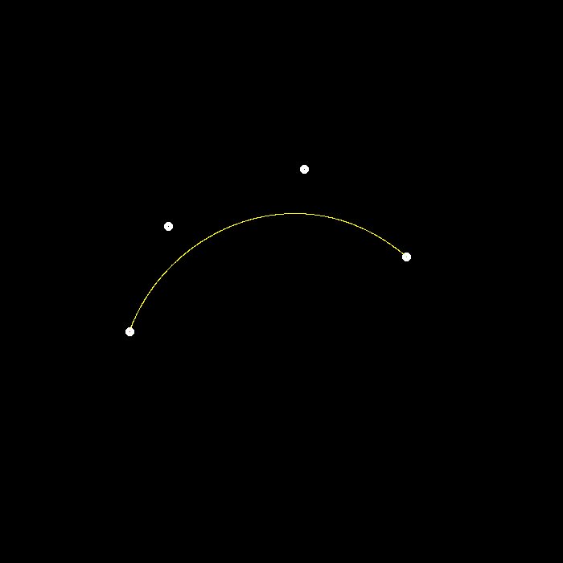

[my_bezier_curve_aa.png](hw4/image/my_bezier_curve_aa.png)

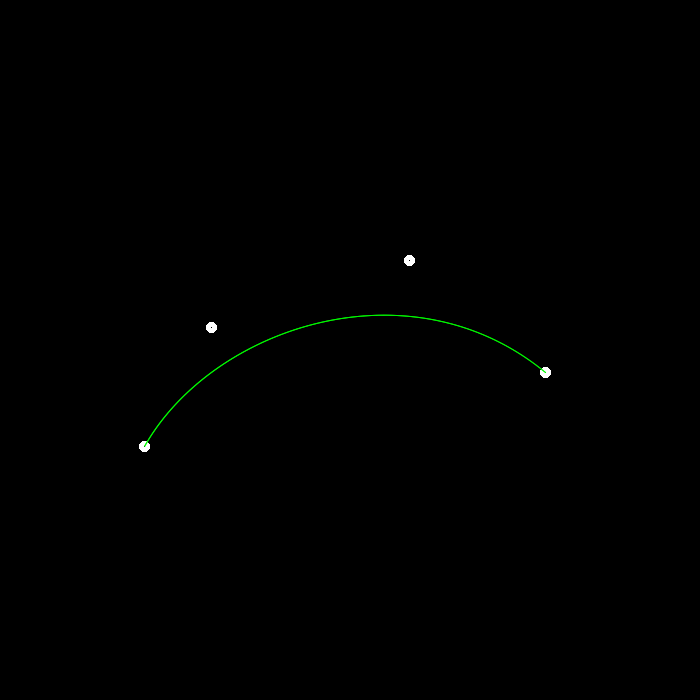

## hw5

[binary-converted.png](hw5/image/binary-converted.png)

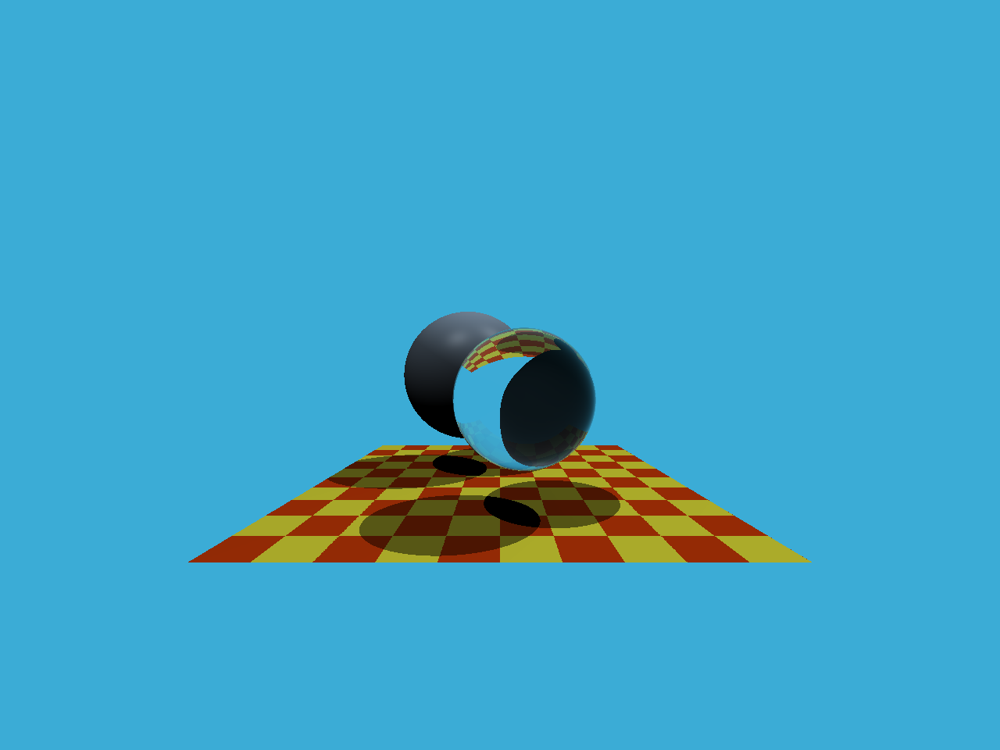

## hw6

[binary-converted.png](hw6/image/binary-converted.png)

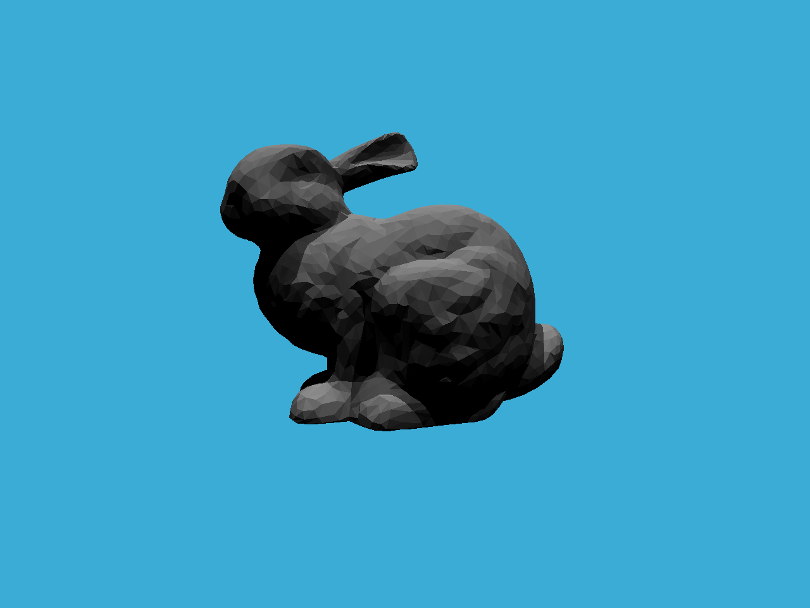

## hw7

[binary-spp16.png](hw7/image/binary-spp16.png)

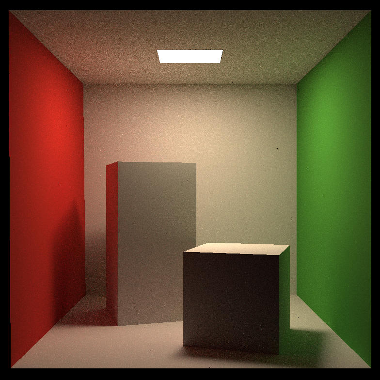

[binary-spp1024.png](hw7/image/binary-spp1024.png)

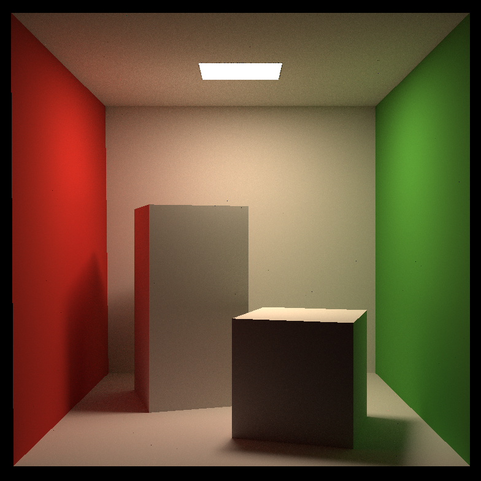

[binary-blender.png](hw7/image/binary-blender.png)

