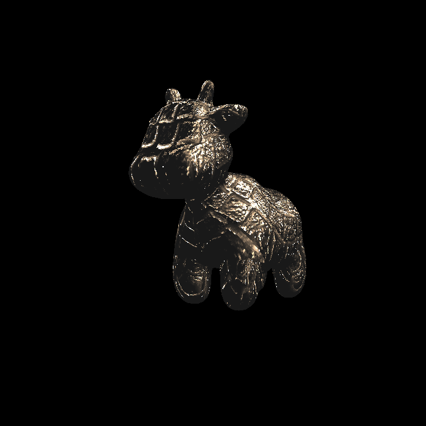

# GAMES101 HW

## hw1

[output.png](hw1/image/output.png)

## hw2

> Finished anti-aliasing.

[output.png](hw2/image/output.png)

## hw3

[normal.png](hw3/image/normal.png)

[phong.png](hw3/image/phong.png)

[texture.png](hw3/image/texture.png)

[bump.png](hw3/image/bump.png)

[displacement.png](hw3/image/displacement.png)

## hw4

[my_bezier_curve.png](hw4/image/my_bezier_curve.png)

[my_bezier_curve_aa.png](hw4/image/my_bezier_curve_aa.png)

## hw5

[binary-converted.png](hw5/image/binary-converted.png)

